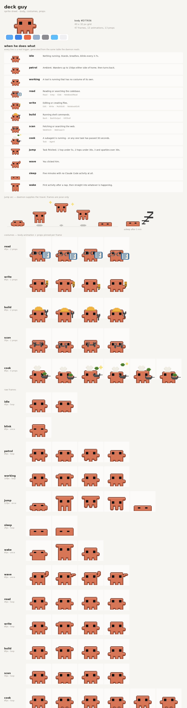

# deck-guy

A pixel creature who lives at the bottom of your screen and tells you what Claude Code is
doing. He walks around while you think, puts on a hard hat when Claude runs `Bash`, jumps
when a task finishes, and falls asleep if you leave him alone — and a line above his head
says which tool is running on what:

```
   ┌──────────────────────────┐
   │ Edit  src/auth.py    4s  │      the timer ticks, so a hung Bash call shows
   └─────────────▽────────────┘
           (buddy)                   hover him for project, session runtime and mode
```

The bubble appears while a step runs and fades a couple of seconds after it ends, so an
idle desktop has nothing on it but him.

Linux only, X11 or XWayland. No dependencies outside the distro packages below.



`preview.png` is generated and is the reference for what each pose means — open it after
any art change.

---

## Requirements

| Need | Why | Debian / Ubuntu package |
|---|---|---|
| Python 3.8+ | everything | `python3` |
| PyGObject + GTK 3 | the window | `python3-gi`, `gir1.2-gtk-3.0` |
| **`python3-gi-cairo`** | the GI↔cairo bridge | `python3-gi-cairo` |
| Pillow | bakes the sprite atlas | `python3-pil` |
| X11, or Wayland with XWayland | positioning and click-through | `xwayland` |

**`python3-gi-cairo` is the one people miss.** `python3-cairo` alone is not enough — without
the bridge every frame raises `KeyError: 'could not find foreign type Region'` and nothing
draws. It is a separate package.

```bash
sudo apt install -y python3-gi python3-gi-cairo gir1.2-gtk-3.0 python3-pil
```

<details>
<summary>Other distros</summary>

```bash
# Fedora
sudo dnf install python3-gobject python3-cairo-gobject gtk3 python3-pillow
# Arch
sudo pacman -S python-gobject python-cairo gtk3 python-pillow
# openSUSE
sudo zypper install python3-gobject-Gdk typelib-1_0-Gtk-3_0 python3-cairo python3-Pillow
```
</details>

Not required: tkinter, ffmpeg, ImageMagick, any pip package, any network access.

### Wayland

He runs under **XWayland**, always. On GTK3's native Wayland backend `move()`,
`set_keep_above()` and `input_shape_combine_region()` are all silent no-ops — he lands
wherever the compositor likes, sits behind other windows, and swallows every click across
the strip. `notify.sh` sets `GDK_BACKEND=x11` for you; you only need XWayland present.

---

## Install

Copy the folder anywhere (`~/Desktop/deck-guy` is the tested spot), then:

```bash
cd deck-guy
./install.sh
```

Restart Claude Code afterwards — hooks load at session start.

That script is safe to re-run and does five things:

1. checks the dependencies, by making the exact cairo call that fails without the bridge
2. stops any running copy **by pid** and clears stale session state
3. bakes `sprites.png`, `sprites.json` and `preview.png` from `sprites.py`
4. merges five hook entries into `~/.claude/settings.json`, backing it up first
5. starts the daemon and tells you the pid

The hook merge keeps every other key and every hook that is not deck-guy's, and replaces
deck-guy's own entries rather than appending to them — so re-running after moving the
folder fixes the paths instead of doubling them.

`./install.sh --check` runs step 1 only and changes nothing.

### Doing it by hand instead

If you would rather not run the script, this is all it does that matters:

```bash
python3 build_sheet.py && python3 build_sheet.py --preview
```

then add to `~/.claude/settings.json`, with **absolute paths** — hooks do not expand `~`
reliably in every context, and the five arguments are not interchangeable:

```jsonc
{
  "hooks": {
    "SessionStart":     [{ "hooks": [{ "type": "command", "command": "/ABS/PATH/deck-guy/notify.sh --ensure idle" }] }],
    "UserPromptSubmit": [{ "hooks": [{ "type": "command", "command": "/ABS/PATH/deck-guy/notify.sh prompt" }] }],
    "PreToolUse":       [{ "matcher": "*",
                           "hooks": [{ "type": "command", "command": "/ABS/PATH/deck-guy/notify.sh working" }] }],
    "Stop":             [{ "hooks": [{ "type": "command", "command": "/ABS/PATH/deck-guy/notify.sh jump" }] }],
    "SessionEnd":       [{ "hooks": [{ "type": "command", "command": "/ABS/PATH/deck-guy/notify.sh idle" }] }]
  }
}
```

`--ensure` on `SessionStart` is what launches the daemon; the other four only write state.
`PreToolUse` fires on every single tool call, which is why `notify.sh` is a bash script with
no forks except one `mv` (~2.5ms per call).

**If you move the folder, rewrite those paths** — or just re-run `./install.sh` from the new
location.

---

## Running him

The daemon starts itself on your next Claude Code session. To drive it yourself:

```bash
env -u LD_LIBRARY_PATH -u GTK_PATH -u GIO_MODULE_DIR GDK_BACKEND=x11 python3 guy.py --demo
```

The `env -u` strip is needed if your shell has a snap-polluted environment, which breaks
GTK's linking. `notify.sh` always strips them.

| Flag | Does |
|---|---|
| `--demo` | cycles every pose and costume, ignores hooks — the fastest way to see the art |
| `--scale N` | pixel size, default 3 (he is 40×32 authored, so 120×96 on screen) |
| `--height N` | height of the invisible strip he lives in, default 340 |
| `--idle-secs N` | seconds of nothing before he sleeps, default 300 |
| `--no-log` | print to the terminal instead of `guy.log` |
| `--no-shape` | skip click-through, for debugging where the window actually is |

Drag him with the mouse to move him; his home position persists in `pos.json`. Click him and
he waves. Hover him for the readout panel. **Right-click him for the menu**, which has:

| Item | Does |
|---|---|
| **Speech bubble** | turns the bubble above his head on and off — remembered in `prefs.json` |
| Wave / Jump! / Nap now | play a state on demand |
| Costume: … | force a costume, for checking the art |
| Quit | stop the daemon |

Turning the bubble off leaves the hover panel working, so the same information is one hover
away rather than gone.

### Where the live state lives

```
~/.deck-guy/sessions/<session_id>.json   one file per running Claude Code session
~/.deck-guy/steps/<session_id>.*         turn timestamps
```

`notify.sh` writes them on every hook event; the daemon watches the directory and deletes a
session when it ends or stops sending heartbeats. Deleting the whole `~/.deck-guy` directory
is safe at any time — it is rebuilt on the next event. Set `DECK_GUY_HOME` to move it.

### Stop / restart

```bash
kill "$(cat daemon.pid)"        # stop
./notify.sh --ensure idle       # start
```

**Do not `rm daemon.pid` to restart.** That bypasses the single-instance guard and you get
two creatures drawn on top of each other. Kill the pid in the file.

### Uninstall

```bash
kill "$(cat daemon.pid)"
cp ~/.claude/settings.json.bak-deckguy ~/.claude/settings.json   # or delete the 5 hook entries
rm -rf deck-guy
```

---

## Troubleshooting

Start with `guy.log` in the project folder — he records every mode and costume change, which
is how both of the last two real bugs were found.

| Symptom | Cause |
|---|---|
| `KeyError: could not find foreign type Region` | `python3-gi-cairo` missing |
| `Couldn't find foreign struct converter for 'cairo.Context'` | same |
| `symbol lookup error: /snap/core20/.../libpthread.so.0` | snap environment; launch with the `env -u` prefix above |
| Nothing appears at all | no `DISPLAY`/`WAYLAND_DISPLAY` (ssh), or the daemon died — run `guy.py --no-log` and read the traceback |
| He is behind other windows, or in the wrong place, or eats clicks | running on native Wayland instead of XWayland; check `GDK_BACKEND=x11` reached him |
| Two of him | `daemon.pid` was deleted while he was alive; `pkill -f 'guy\.py'` and start once |
| He never reacts to Claude | hooks not loaded (restart Claude Code), or the paths in `settings.json` point at the old folder |
| He reacts but never stops working | a session died without a `Stop`; he times out after 45s on his own |
| No bubble, but he still animates | the payload had no target field for that tool — expected for `BashOutput`, `WebSearch` and anything new; he shows the bare tool name |
| He is reacting to a session you closed | check `~/.deck-guy/sessions/` — a file with an old `heartbeat` should vanish within 45s; if it does not, the daemon is not running |
| Sprites look wrong after editing `sprites.py` | re-run `python3 build_sheet.py`, then restart the daemon |
| `pgrep -f deck-guy/guy.py` finds nothing | he was launched by relative path; match `guy\.py` or read `daemon.pid` |

---

## What is in here

```
guy.py           the daemon: window, animation, state machine
sprites.py       the art, as ASCII grids + palette + anchors  <- edit this
build_sheet.py   bakes sprites.png / sprites.json / preview.png
sessions.py      live sessions: parse, reap, work out what to call the target
bubble.py        the speech bubble and hover panel
test_sessions.py python3 test_sessions.py  (no display needed)
notify.sh        the hook target; writes a session file, starts the daemon
install.sh       dependency check, art build, hook wiring
PLAN.md          how the pet is built and why, plus every gotcha hit
ROADMAP.md       the plan to turn him into a live Claude Code HUD
phases/          one document per HUD phase (phase 1 built, 2-7 specced)
```

To add a new activity: draw a prop grid in `PROPS`, add a `COSTUMES` entry with per-frame
anchors, map the tool in `TOOL_COSTUME`, rebuild. No draw code, no new branch in the state
machine. Full procedure in `PLAN.md`.
